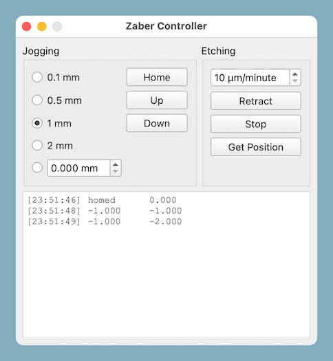
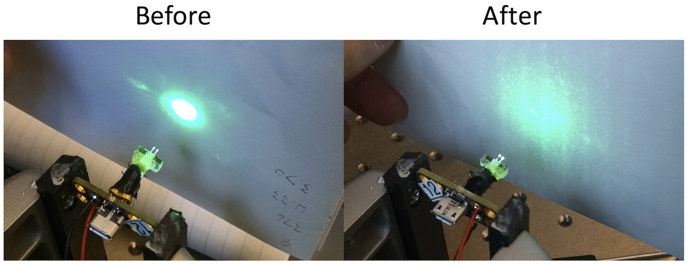
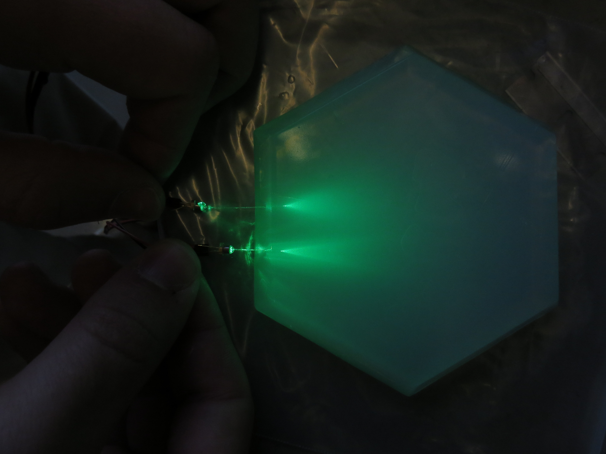
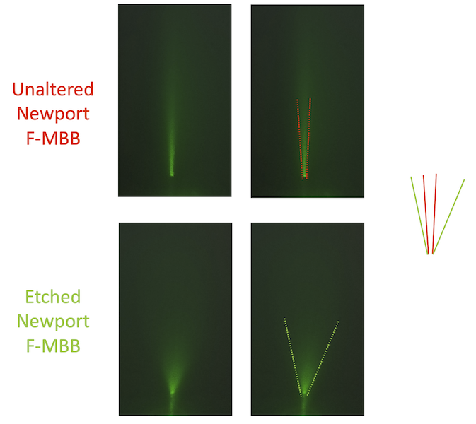
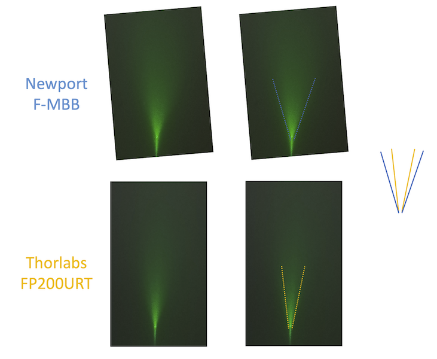

# Fiber etching control software

We etch the fibers of the custom [implant](https://karpova-lab.github.io/cerebro/Hardware/implant.html) that we build for rodent behavior experiments.
Etching fibers can help increase the number of cells reached for optogenetic stimulation (see: https://www.nature.com/articles/nature14066/figures/11)

This GUI application is used to control a Zaber [T-LHM050A](https://www.zaber.com/products/linear-stages/X-LHM/specs?part=X-LHM050A) linear stage. 
With it, we can precisely submerge glass fibers into acid then slowly retract the fibers to create an etched and tapered point. 

## Dependencies
- [Python 3](https://www.python.org/downloads/) 
- [PyQt5](https://pypi.org/project/PyQt5/)
- [Zaber motion library](https://pypi.org/project/zaber-motion/)

## Protocol
Based on the [Brody Lab protocol](http://brodywiki.princeton.edu/wiki/index.php/Etching_Fiber_Optics) we do the following:
- Use a [stripping tool](https://www.thorlabs.com/thorProduct.cfm?partNumber=T12S21) to strip a [200 micron Newport fiber (F-MBB)](https://www.newport.com/p/F-MBB) to remove outer jacket
- Use a [cleaver](http://www.fiberinstrumentsales.com/fis-lynx-precision-cleaver-with-fiber-basket.html) to cut fiber down to ~ 15mm
- Use a butane torch/lighter to burn away ~3mm of thin plastic coating to expose the tip for etching
- Fill a small container with 48% HF, and top with a layer of mineral oil
- Submerge the tip ~2mm past the mineral oil/HF interface.
- Retract the fiber at ~20µm/min. This can vary drastically depending on how fresh the HF is. The more times the same HF is used, the weaker the etching is, and therefore the retraction will need to be slower or the dipping process may need to be repeated.

## Etching comparisons
The tests below were done to see if our process for etching was effective. Once we saw that it worked, we wanted to determine which brand of fiber produced the best results.
### Setup
- Made agar with 100mL buffer and ~ 0.7g of agarose
- Powered at the same time via the same PWM circuit
- Camera settings:
    - Aperture: F1.7
    - Exposure time : 1/500 s
    - ISO: 50

### Etching comparison
[Newport F-MBB](https://www.newport.com/p/F-MBB) was compared with and without having been etched.

### Manufacturer comparison
Both the [Newport F-MBB](https://www.newport.com/p/F-MBB) and [Thorlabs FP220URT](https://www.thorlabs.com/thorproduct.cfm?partnumber=FP200URT) were etched then compared.

